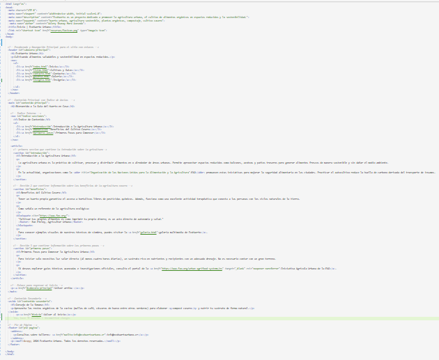

---

### El sitio personal[cite: 1]

Proyecto propio construido de forma autónoma.[cite: 1]
**Tema del sitio:** _EcoHuerto Urbano_[cite: 1]

| Página | Qué contiene | Sesiones aplicadas | Ver | Validación |
|:-------|:-------------|:------------------:|:---:|:----------:|

| `index.html` | Estructura semántica, metadatos, texto jerarquizado, citas, enlaces y anclas[cite: 1] | S03 · S04 · S06[cite: 1] | [ver](Unidad_02_html/sitio-personal/index.html)[cite: 1] | [ver]
(recursos/imgindex.html.png)[cite: 1] |

| `listas.html` | Las tres listas, lista anidada y tabla con celdas combinadas[cite: 1] | S05[cite: 1] | [ver]
(Unidad_02_html/listas.html)[cite: 1] | [ver]
(recursos/imglistas.html.png)[cite: 1] |

| `contacto.html` | Formulario con ocho campos y validación de HTML[cite: 1] | S06[cite: 1] | [ver]
(Unidad_02_html/sitio-personal/contacto.html)[cite: 1] | [ver]
(recursos/imgcontacto.html.png)[cite: 1] |

| `galeria.html` | Imágenes, audio, video con subtítulos y gráficas SVG[cite: 1] | S07 · S08[cite: 1] | [ver]
(unidad_02_html/sitio-personal/galeria.html)[cite: 1] | [ver]
(recursos/imggaleria.html.png)[cite: 1] |

**Decisiones que tomé**[cite: 1]

| Decisión | Qué elegí | Por qué |
|:---------|:----------|:--------|
| Tema del sitio | EcoHuerto Urbano[cite: 1] | Para promover la agricultura sostenible y el cultivo de alimentos en la ciudad[cite: 1] |
| Atributo de la lista ordenada | `type="1"` y `start`[cite: 1] | Para llevar un orden cronológico adecuado en las actividades del huerto[cite: 1] |
| Formatos de imagen usados | `.png` y `.jpg`[cite: 1] | Para mantener compatibilidad y buena nitidez en la galería[cite: 1] |
| Formas del gráfico SVG | Círculos, líneas, polígonos y rutas (`path`)[cite: 1] | Para crear una insignia vectorial nítida con hoja, estrella y bordes dorados[cite: 1] |

**Cómo se ve**[cite: 1]

  

[cite: 1]

*Portada del sitio personal al cerrar la Unidad 2.*[cite: 1]

[cite: 1]

**Comprobado en dos navegadores:**[cite: 1]
[Chrome](recursos/sp-navegador-chrome.png) · [Edge](recursos/sp-navegador-edge.png)
